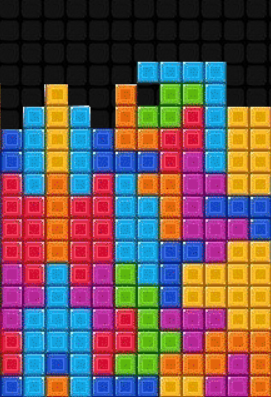

Grille de jeu "Tétris" 
======================

Tout le monde connaît le jeu **tétris** qui consiste à empiler des formes sans sortir du cadre défini par le jeu.

La programmation d'un jeu tel repose sur une **structure de données** adaptée qui permet de gérer les formes à empiler et leurs déplacements. On se propose de réfléchir à la bonne structure de données à utiliser et aux modifications qu'elle devra subir.

Pour simplifier cette réflexion, on se limite :

-   à un espace de jeu réduit à 6 lignes et 4 colonnes;
-   une forme géométrique de base composée de 1 carré.

#.  Par quelle structure de données peut-on représenter l'espace de jeu ? Quelle(s) valeur(s) lui attribuer au début du jeu ?
#.  On repésente ci-dessous un carré dans le jeu.

    .. figure:: ../img/grille_1.svg
        :align: center
        :width: 180

    Comment représenter cette valeur ? Comment le positionner dans l'espace de jeu ?

#.  Le carré peut être déplacé avec les touches directionnelles du clavier.

    .. figure:: ../img/grille_2.svg
        :align: center
        :width: 180

    a)  Que faut-il tester pour que le carré reste dans l'espace de jeu ?
    b)  Quels sont les changements dans la structure de données représentant l'espace de jeu lorsque le carré est déplacé ?
